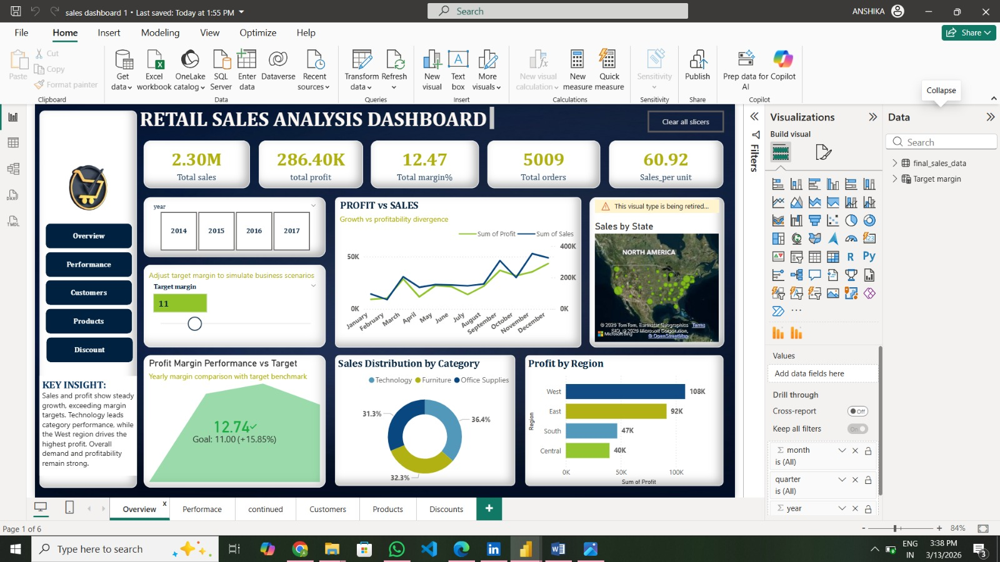
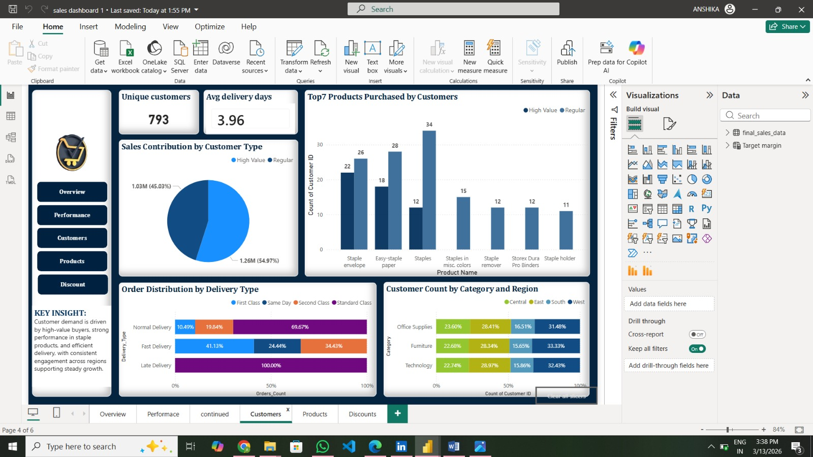
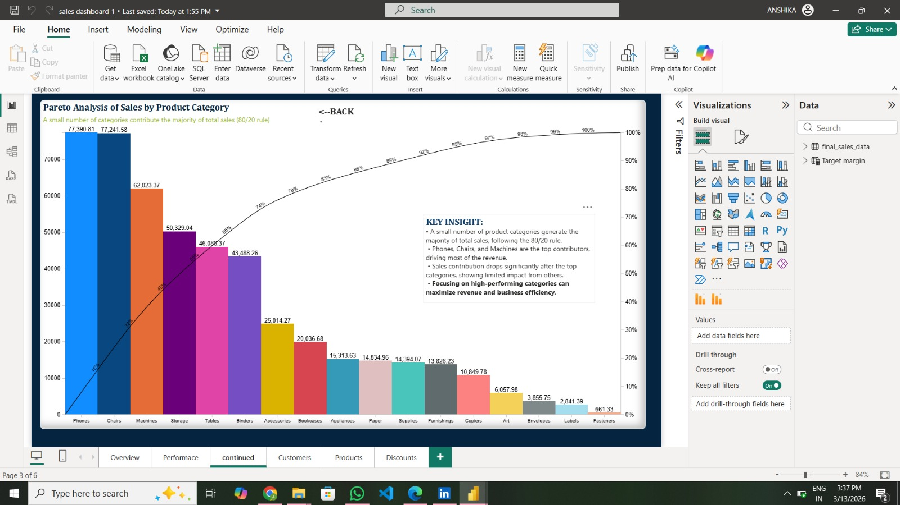

# 🛒 Customer 360 Retail Sales Analysis

## 📌 Project Overview

This project performs a **Customer 360 Retail Sales Analysis** to understand customer purchasing behavior, product performance, and sales trends using **Python and Power BI**.

The goal of this project is to transform raw retail transaction data into meaningful insights that support **business decision making and sales strategy**.

The analysis includes:

• Customer Segmentation using RFM Analysis  
• Customer Retention Analysis using Cohort Analysis  
• Product Association using Market Basket Analysis  
• Interactive Sales Dashboard using Power BI  

---

# 📊 Dashboard Preview

## Retail Sales Overview Dashboard



---

## Customer and Product Distribution



---

## Pareto Sales Analysis



---

# 📂 Dataset

The dataset contains retail transaction records including:

- Customer ID
- Invoice Date
- Product Category
- Sales Amount
- Order Information
- Delivery Type
- Region

Total transactions analyzed: **~397,000**

---

# 🧠 Python Analysis

Python was used for advanced customer and sales analysis.

## 1️⃣ RFM Analysis (Customer Segmentation)

RFM stands for:

- **Recency** → How recently a customer purchased
- **Frequency** → How often a customer purchases
- **Monetary** → How much money the customer spends

Customers were scored from **1–5** for each metric and grouped into segments such as:

- Champions
- Loyal Customers
- Recent Customers
- At Risk
- Hibernating

This helps businesses identify **high-value customers and design targeted marketing strategies.**

---

## 2️⃣ Cohort Analysis (Customer Retention)

Cohort analysis groups customers based on their **first purchase month** and tracks their activity over time.

This helps measure:

• Customer retention  
• Customer lifetime engagement  
• Loyalty patterns  

---

## 3️⃣ Market Basket Analysis

Market Basket Analysis identifies products that customers frequently purchase together.

The **Apriori algorithm** was used to generate association rules.

Example rule:

Product A → Product B

Meaning customers who buy Product A are also likely to buy Product B.

This helps businesses improve:

• Cross-selling strategies  
• Product bundling  
• Recommendation systems  

---

# 📈 Power BI Dashboard

Power BI was used to build an interactive dashboard showing:

• Total Sales and Profit  
• Sales by Category and Region  
• Profit vs Sales Trends  
• Customer Distribution  
• Delivery Performance  
• Pareto Sales Analysis (80/20 Rule)

These dashboards help businesses **monitor performance and make data-driven decisions**.

---

# 🧰 Technologies Used

Python  
Pandas  
NumPy  
MLxtend  
PostgreSQL  
Power BI  

---

# 📊 Key Insights

• A small number of product categories generate the majority of sales (Pareto principle).  
• High-value customers contribute significantly to revenue.  
• Customer retention decreases after the first few months.  
• Certain products are frequently purchased together.

These insights help businesses improve **sales strategies and marketing decisions**.

---

# 🚀 How to Run the Project

1 Clone the repository

```
git clone https://github.com/yourusername/customer-360-retail-analysis.git
```

2 Install dependencies

```
pip install -r requirements.txt
```

3 Run the analysis script

```
python rfm_engine.py
```

4 Open the Power BI dashboard file

```
customer_360.pbix
```

# 📅 Weekly Project Progress

Week 1 → Project Setup and Data Understanding  
Week 2 → Data Cleaning and PostgreSQL Integration  
Week 3 → Customer Analytics using Python (RFM, Cohort, Market Basket)  
Week 4 → Power BI Dashboard Development  

Detailed weekly progress can be found in the **progress folder**.

## 🏗️ Project Architecture

The project follows an end-to-end data analytics pipeline:

Retail Dataset → Python Data Processing → PostgreSQL Database → Power BI Dashboard

1. Raw retail transaction data is processed using **Python (Pandas)**.
2. Customer analytics such as **RFM segmentation, Cohort Analysis, and Market Basket Analysis** are performed.
3. The processed results are stored in a **PostgreSQL database**.
4. **Power BI** connects to the database to create interactive dashboards for business insights.
   
 ## Project Pipeline

Retail Dataset  
⬇  
PostgreSQL Database  
⬇  
Python Analytics (RFM, Cohort, Market Basket Analysis)  
⬇  
Power BI Dashboard


Data Analytics | Python | Power BI | SQL
